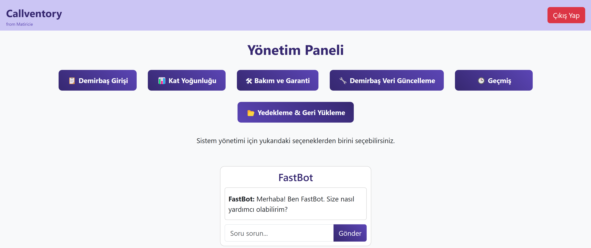
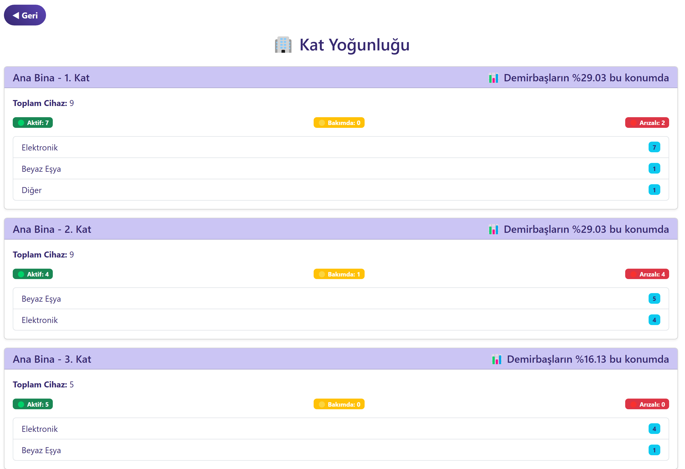

# 🎧 Callventory - Call Center Envanter Yönetim Sistemi

## 🚀 Proje Hakkında

Callventory, çağrı merkezi ekipmanlarının yönetimini kolaylaştıran **full-stack bir envanter takip sistemidir**.  
Bu sistem ile çağrı merkezi ekipmanlarını kaydedebilir, bakım ve garanti süreçlerini takip edebilir ve **detaylı analizler** yapabilirsiniz.  

---

## 🎯 Özellikler

✅ **Envanter Yönetimi** – Çağrı merkezindeki cihazları kategori ve parametre bazlı saklayın.  
✅ **Bakım ve Garanti Takibi** – Otomatik bakım planlaması yaparak cihazların sürelerini takip edin.  
✅ **Yoğunluk Analizi** – Kat bazlı kullanım yoğunluğunu analiz ederek operasyonel verimliliği artırın.  
✅ **Tam Entegrasyon** – **Frontend (React)** ve **Backend (Node.js + Express + MSSQL)** uyumlu çalışır.  

---

## 🏰️ Teknoloji ve Araçlar

### 🔧 Backend  
- **Node.js** + **Express.js**  
- **MSSQL** (Veritabanı)  
- **JWT ile Kimlik Doğrulama**  
- **RESTful API**  
- **Multer (Dosya yükleme)**  

### 🎨 Frontend  
- **React.js** + **TypeScript**  
- **React Router**  
- **Axios (API çağrıları için)**  
---

## 📺 Proje Klasör Yapısı

```plaintext
Callventory/
│─ backend/
│   ├─ backups/              # Yedekleme dosyaları
│   ├─ config/               # Yapılandırma dosyaları
│   ├─ controllers/          # API isteklerini yöneten modüller
│   ├─ middlewares/          # Ara katman işlemleri
│   ├─ models/               # Veritabanı modelleri
│   ├─ routes/               # API yönlendirmeleri
│   ├─ uploads/              # Dosya yüklemeleri
│   ├─ backup.js             # Otomatik yedekleme betiği
│   ├─ server.js             # Sunucu giriş noktası
│─ frontend/
│   ├─ public/               # Statik dosyalar
│   ├─ src/                  # React kaynak kodları
│─ package.json              # Proje bağımlılıkları
│─ README.md                 # Proje dokümantasyonu
```

---

## 🛠️ Kurulum

### 🚧 Gereksinimler

- Node.js (v16+)
- MSSQL Server
- **Frontend için**: npm veya yarn  

### 🔥 Adım 1: Projeyi Klonlayın  

```sh
git clone https://github.com/HIZMALI/Callventory.git
cd Callventory
```

### 🔥 Adım 2: Backend Kurulumu  

```sh
cd backend
npm install
node server.js
```

### 🔥 Adım 3: Frontend Kurulumu  

```sh
cd ../frontend
npm install
npm start
```

---

### 🔥 Adım 4: Giriş

server.js -> const users = değişkeninden kullanıcı değişikliği yapılabilir

### Demo Giriş

admin:matiricie

## 📊 Kullanıcı Arayüzü (UI)

### 🎨 Ana Sayfa  



### 📊 Yoğunluk Analizi  
[

---

## 👤 Katkıda Bulunanlar

- **Beril Yenice** – Ürün Geliştirme
- **Mert Hızmalı** – Full Stack Developer

---

## 📢 İletişim

📩 E-posta: mert@morve.com.tr

## 🌍 Lisans

**MIT Lisansı**  
Bu proje açık kaynak olarak yayınlanmıştır. Özgürce geliştirebilir ve kullanabilirsiniz.  
